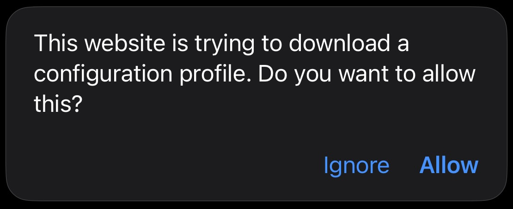
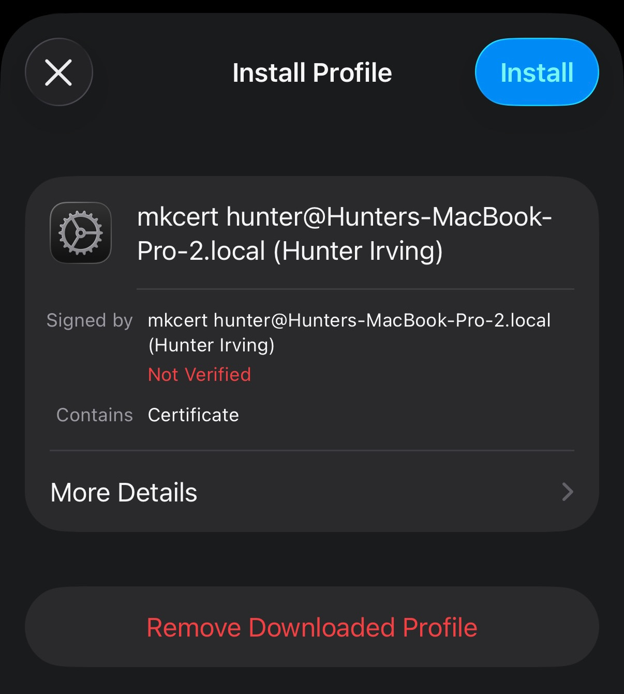
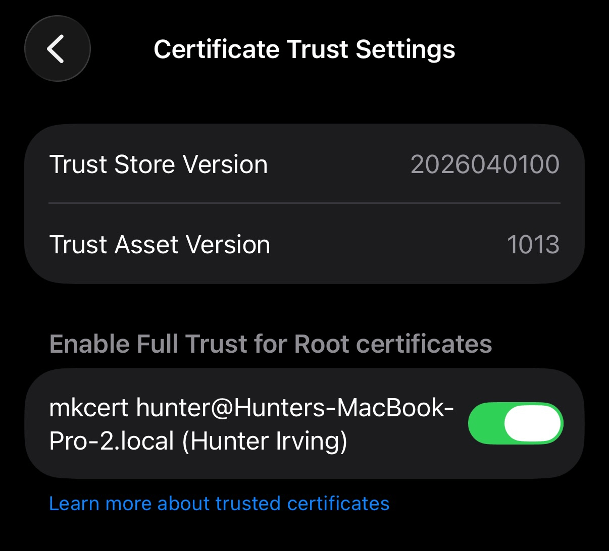

# 💿 mixapps

mixapps are like mixtapes or mix CDs, but packaged as <a href="https://hunterirving.github.io/web_workshop/pages/pwa">Progressive Web Apps</a> that you can install for offline use.

	

## demo

<a href="https://hunterirving.com/worn_grooves/">worn grooves ↗</a>
 (public-domain recordings)

## key features
- installable mixes that work offline on iOS, Android, Windows, MacOS, and Linux
- support for `mp3`, `m4a`, `ogg`, `flac`, and `wav` audio formats
- highly customizable interface (just add CSS!)

	

## own something and be happy

modern playlists are platform-locked, often require a paid subscription, and decay as licenses expire.

these days, we mostly point to things that we don't control.

	   

 

mixapps are immutable artifacts. 

they live on your devices, independent of platforms, contracts, and corporate whim.  

once you install one, it's yours.  

## quickstart
1. **serve it**
	- run `./serve.py` to start a development server. while the server is running, you can:
		- **add new tracks** by...
			- dragging them into the browser window
			- moving them into the `mix/` directory
			- running `./rip.py` to rip tracks from a physical CD
			- running `./buy.py` to buy tracks on iTunes
		- **reorder tracks** by dragging them up or down in the list
		- **delete tracks** with `shift + click`

2. **build it**
	- once you're happy with your mix, run `./build.py` and follow the interactive prompts to generate `manifest.json` and `service-worker.js`, which enable PWA installation and offline functionality.

3. **ship it**
	- **public host:** when using media you have distribution rights for, you can upload the entire project directory to any static web host with HTTPS support (GitHub Pages, Neocities, AWS S3, etc). 
	**publishing files you don't have the right to distribute may constitute copyright infringement.**

		or...

	- **your own wifi:** install onto your own devices using a <a href="#local-network-installation">local HTTPS server</a>. no public host needed, and nothing ever leaves your network.

4. **save it**
	- once your mixapp is hosted, anyone can install it by opening the URL and following their browser's PWA installation steps:
		- **iOS (Safari)**: tap `···` → `Share` → `View More` → scroll down to reveal and tap `Add to Home Screen` → `Add`
		- **Android**:
			- **Firefox**: tap `⋮` → `··· More` → Add to Home screen → Add to home screen
			- **Chrome**: tap `⋮` → Add to Home screen → Install
		- for detailed PWA installation steps for your browser/OS, <a href="https://hunterirving.github.io/web_workshop/pages/pwa/">click here</a>.
	- after the initial download and cache, mixapps work completely offline and behave like native applications ⤵  
	 
	(pictured: integration with iOS lockscreen controls)

## customization
add your own `custom.css`, `custom.js`, and/or `album_art.jpg` to `mix/` to customize your mixapp's appearance and behavior.

## local network installation

<strong>install on your own devices without a public host</strong>

 

PWA installation requires a secure (HTTPS) connection. the easiest way to get one is to upload your files to a public host, but publishing files this way is distribution, which means it's only appropriate for content you have the right to distribute.

if you'd like to install mixapps without pushing to a public host, you can use `https_serve.py` to serve the necessary files over HTTPS on your local network.

<h3>how it works</h3>

normally, an HTTPS site proves its identity with a certificate signed by a **certificate authority (CA)** that browsers already trust. a server on your own network has no such signature, so browsers refuse connections by default.

<a href="https://github.com/FiloSottile/mkcert">mkcert</a> bridges this gap with two pieces:

- a **CA**, created once on your computer, that acts as a trusted issuer.
- a **server certificate**, signed by your local CA, which your local server presents to prove its identity.

on each device you want to install a mixapp to, you add your local CA to that device's list of trusted Certificate Authorities. after that, its browser will automatically accept the certificate presented by your local server, letting you connect and install your mixapp as a PWA.

<h3>security</h3>

trusting a CA tells a device to trust **any** HTTPS certificate the CA issues (for any website, not just your mixapp server). in effect, you're asking the installing device to trust your computer to vouch for the whole web.

in practice the risk is small, because an attack needs **three** things to line up at once: your CA's private key has leaked off your computer, the attacker is on a network where they can intercept the installing device's traffic, *and* that device still trusts the CA. deny any one and there's nothing to exploit, so a few habits keep you safe:
- **guard your local CA's private key**: as long as you don't move or share this file, it stays safely on your computer (see <a href="#cleaning-up">cleaning up</a>).
- **install over a network you control**: your own wifi, not public/shared.
- **leave trust disabled when it isn't needed**: iOS lets you toggle trust on/off per custom CA; on Android, you can remove the CA when you're done and re-add it next time you want to install (see <a href="#cleaning-up">cleaning up</a>).

<h3>usage</h3>

1. run `./https_serve.py`. it will offer to install `mkcert` if needed, then create a local certificate authority (CA) on your computer.
2. **first time on a new device:** scan the first QR code to download the CA certificate, then install and trust it.
	- **iOS:**
		1. scanning the QR code prompts you to allow the download. tap **Allow**. 
		 
		2. **install it:** open `Settings` → `General` → `VPN & Device Management`, tap the downloaded profile, and tap **Install**. 
		 
		3. **trust it:** open `Settings` → `General` → `About` → `Certificate Trust Settings` and toggle the CA **on**. 
		 
	- **Android:** open the downloaded file, or go to `Settings` → `Security` → `Encryption & credentials` → `Install a certificate` → `CA certificate`, and confirm the install. (on Android, installing a user CA is what makes it trusted; there's no separate trust toggle. exact menu names vary by version/manufacturer.)

	a device that already trusts the CA from a previous run can skip this step.

3. scan the second QR code to open your mixapp over HTTPS, then follow the <a href="https://hunterirving.github.io/web_workshop/pages/pwa">PWA installation instructions</a> for your device/OS to add it to your homescreen. after the initial installation and cache, mixapps work completely offline; they no longer need the network, server, or certificate.

<h3 id="cleaning-up">cleaning up</h3>

- **on the installing device (recommended):** it's good practice to untrust the CA once you're done installing, and only re-enable it when you want to install another mixapp.
	- **iOS, disable (keep installed):** `Settings` → `General` → `About` → `Certificate Trust Settings` → toggle the CA **off**; you can re-enable this in the future if you'd like to install another mixapp.
	- **iOS, remove entirely:** `Settings` → `General` → `VPN & Device Management` → tap the profile → **Remove Profile**.
	- **Android, remove:** `Settings` → `Security` → `Encryption & credentials` → `User credentials` (or `Trusted credentials` → `User`) → tap the mkcert entry → **Remove**.
- **on your computer:** keeping mkcert's CA installed long-term is normal for a development machine, as long as you protect your CA's private key. you'd only need to remove the CA if you were done with it for good or thought your private key may have been exposed. in those cases, `./https_serve.py --reset` removes this tool's own certificates, then asks separately before touching the shared mkcert CA: first to untrust it on your development machine, then to delete its private key. mkcert uses one CA for everything, so if you also use mkcert for other projects, decline those steps to leave your CA intact.

## licenses
this project is licensed under the <a href="LICENSE">GNU General Public License v3.0</a>.

the <a href="https://velvetyne.fr/fonts/basteleur/">Basteleur</a> font by <a href="https://keussel.studio/">Keussel</a> (distributed by <a href="https://velvetyne.fr/">Velvetyne</a>) is licensed under the <a href="resources/fonts/Basteleur/LICENSE.txt">SIL Open Font License, version 1.1</a>.
