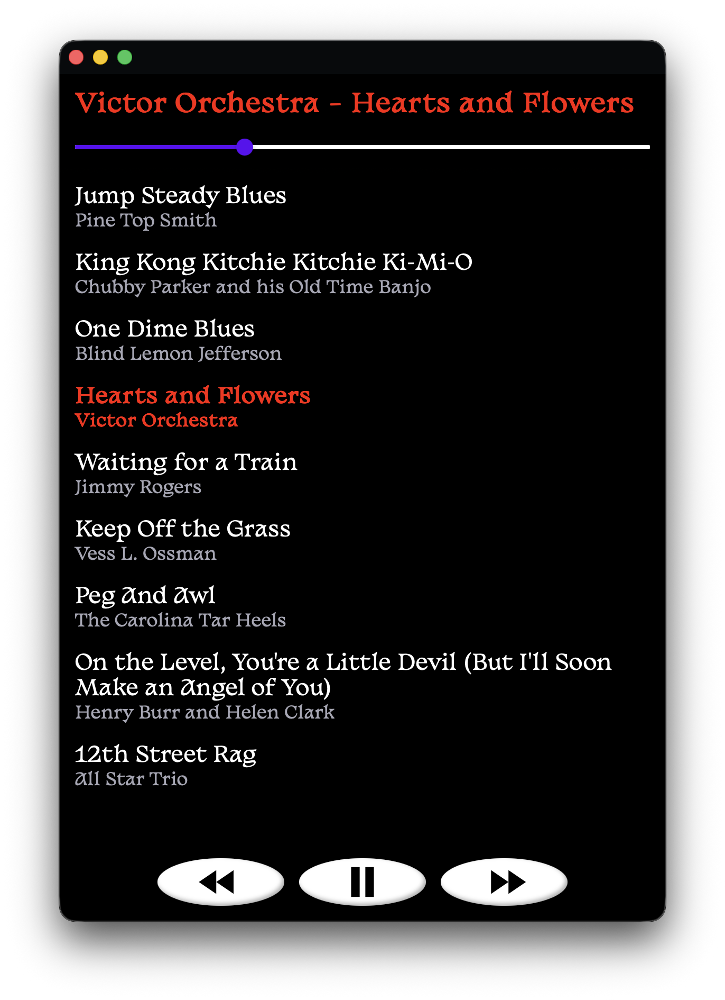
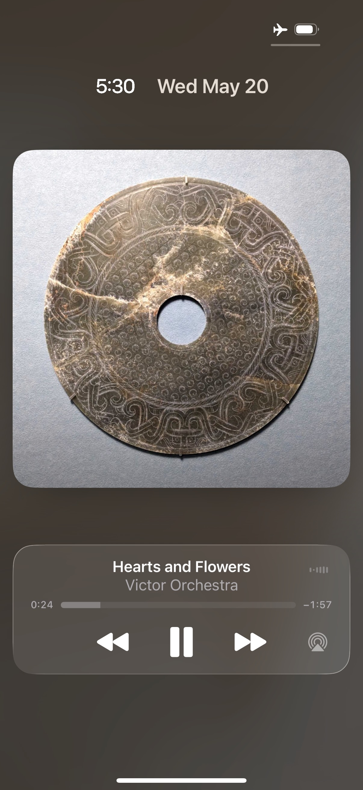

# 💿 mixapps

resurrect the lost art of <a href="https://ihavethatonvinyl.com/liner-notes/the-lost-art-of-the-mixtape/">mixtape</a><a href="https://melos.audio/blogs/information/the-lost-art-of-the-mixtape">-making</a> by packaging folders of .mp3s as progressive web apps.

	

## demo
<a href="https://hunterirving.com/vibe_capsule">public domain beats to code to ↗</a>

## key features
- mixtapes as self-contained apps that work completely offline on Windows, MacOS, Linux, iOS, and Android
- lock screen media controls (iOS & Android) and keyboard media key support
- highly customizable interface (just add CSS!)

	

## own something and be happy
modern playlist sharing is ephemeral and platform-locked. shared playlists often require a paid subscription, and decay as licenses expire.
> [!WARNING]
> <i>This song is no longer available in your country or region.</i>

in the transition from physical mixtapes to cloud-hosted playlists, we stopped giving each other digital things. these days, we mostly point to things that we don't control.

but our custom of gift-giving can be restored, if we restore the structures that enabled it.

when you give someone a mixapp, you're giving them a digital artifact – something that can persist on their device independent of platforms, contracts, or corporate whim.  

you gave them something.

now it's theirs.

hits different, right?  

## quickstart
1. **prep your playlist**
	- add your audio files to the `/mix` directory, or use:
		- `./rip.py` to rip tracks from a physical CD
		- `./buy.py` to search for songs to purchase (opens in iTunes on MacOS, <a href="https://song.link/i/1651294855">song.link</a> otherwise)
	- run `./build.py` to parse `/mix` and populate `tracks.json`, which defines the songs available to the player. after running `./build.py` once, you can manually edit `tracks.json` to refine your mix.
	- optionally, add an `album_art.jpg` to `/mix` to set the cover art for your mix.
	- supported audio formats: `.mp3`, `.m4a`, `.ogg`, `.flac`, `.wav`

2. **soundcheck**
	- run `./host.py` to start a local HTTP server for testing. you can scan the QR code printed to the terminal to test the app from any device on your local network.

3. **manifesting**
	- run `./generate_manifests.py` and follow the interactive prompts to specify an app name and the remote server path where your app will be hosted.
		- this creates the config files that enable offline functionality: `manifest.json`, `resource-manifest.json`, and `service-worker.js`.

4. **ship it**
	- upload the entire project directory to any web host with HTTPS support (GitHub Pages, AWS S3, etc.)

5. **share it**
	- send the hosted URL to your recipient and walk them through the installation process:
		- **iOS (Safari)**: tap `···` → `Share` → `View More` → scroll down to reveal and tap `Add to Home Screen` → `Add`
		- **Android**:
			- **Firefox**: tap `⋮` → `··· More` → Add to Home screen → Add to home screen
			- **Chrome**: tap `⋮` → Add to Home screen → Install
		- for detailed PWA installation steps for your browser/OS, <a href="https://hunterirving.github.io/web_workshop/pages/pwa/">click here</a>.
	- after the initial download and cache, mixapps work completely offline and behave like native applications  
	 
	(pictured: integration with iOS lockscreen controls)

## customization
add `custom.css` and/or `custom.js` to your `/mix` folder to customize your mixapp's appearance and behavior. these files are automatically loaded if present.

## intellectual property notice
ensure you have the right to distribute any media files you include in public mixapps. personal archival backups are for your own use. sharing them with others, even as a gift, is not covered by fair use or backup exceptions.

it may have looked like i winked just now, but that was a blink. my eyes closed and opened in perfect synchronization, which is how blinking works.

## license
<a href="LICENSE">GNU GPLv3</a>
